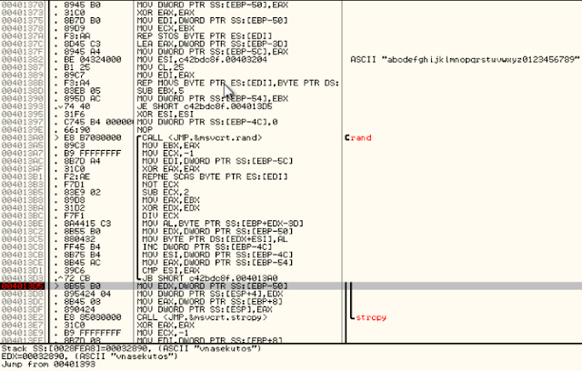

Today we'll be looking at a ringzer0 challenge called "Crack Me 1" made by Mr.Un1k0d3r and can be found here: https://ringzer0ctf.com/challenges/9 - the challenge is worth 3 points.

The goal of the challenge is to find the flag hidden within.

When first executing the executable, we are presented with the following MessageBox:

After pressing OK, the program exits.

# Static analysis:

I noticed in PEView that there is a custom resource section, suggesting that their might be hidden data within:

As I suspected, I was right. We can see the first bytes represent the ASCII value "MZ", which is the magic number for an executable. This is also confirmed by the "This program cannot be run in DOS mode" message. Almost every Windows executable has this message at the beginning of the header.

If we scroll further down, we can see some interesting text:

So far, we have deduced that there is a resource section hidden within the main PE file that also contains a PE file. We have found that a "Secret Message" may be hidden within the nested PE file.

Moving over to IDA, we see the string that is used in the MessageBox when first executing the program. Taking a look at the imports, we see imports such as FindResourceA, LoadResource, MessageBoxA, AddAtomA, FindAtomA, and GetAtomNameA.

We will focus on the Resource functions for now since we found an embedded exe within the resource section of the file.

Our next goal is to find out how the resource is being loaded and what it's being loaded into. We might be able to see the flag using some dynamic analysis.

Let's hop over to Ollydbg.

# Dynamic analysis:

Stepping over instructions, we find ourselves in a function that has a peculiar ASCII string. The loop seems to call the "rand" function and creates a random string. Executing this loop multiple times yields different strings. As you can see below, the string returned for this one was "vnasekutos":

Stepping a little further, we can see another string, ".dll". Interesting.

After the above function exits, we find ourselves in the function that loads our resource. As you can see below, it is calling LoadResource for the RT_RCDATA section, which matches with what we found using PEView.

After stepping a little more, we can see a call to strcat which concatenates our string we found earlier to another string with the value set as our AppData\Roaming directory.

Finally, we can see a call to CreateFileA and WriteFile. We can now suspect that each time we execute the crack me, it creates a randomly-named dll file in our AppData\Roaming directory, loads the PE file found in the resource section and writes the PE file to our dll file.

Let's take a look at that dll file.

As you can see, I have executed the crack me a few times already:

When viewing one of these dll's in IDA, we quickly view the imports window and select the MessageBoxA function. We're taken here:

This is the same "Secret Message" string we saw earlier when viewing the resource section in PEView.

Let's see if we can call the DisplayMessage function to display the secret message for us:

