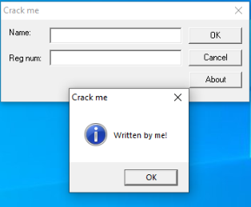
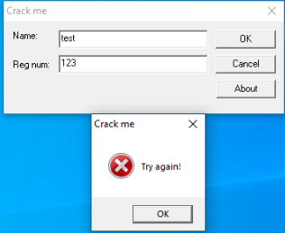
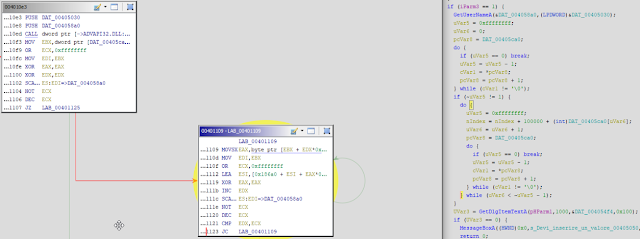
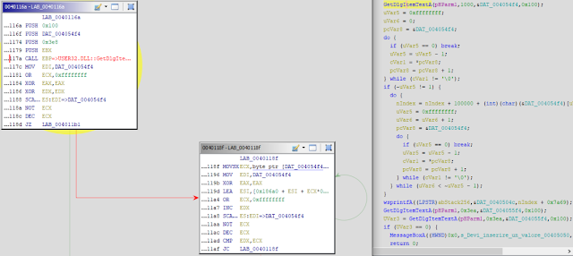
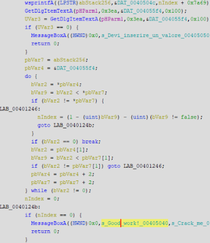
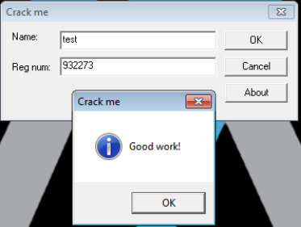

Today we'll be reversing a crackme by Saduz called "Visual c++ crackme", which can be found here: https://crackmes.one/crackme/5c1d6f5f33c5d41e58e005f5

# Dynamic analysis:

When executing the crackme, you are presented with a form with two textboxes asking for a Name and Reg num. When clicking the About button, a MessageBox is spawned.



We try "test" as our Name and "123" as our Reg num, but a MessageBox is spawned asking us to try again.



There's not much to it, so next, we'll open the crackme in Ollydbg for further analysis.

We know that the crackme spawns a MessageBox with the text "Try again!", so we could start searching for that. Right click in the CPU window in Olly > Search for > All referenced text strings.

We immediately see a "Good work!" string. Double click on that to be taken to the sub routine that most likely handles our input.

In order to find out what values need to be written in both of the Name and Reg num textboxes, we will need to find out how it handles our inputs first.

Generally in C, we are looking for a couple of methods that handle input from textboxes. Those are GetWindowText() and GetDlgItemText(). If we right click in the CPU window in Olly > Search for > All intermodular calls, and sort by Destination, we can find user32.GetDlgItemText(). Highlight the method and press F2 to set a breakpoint.

Press play in Olly to resume the crackme. We will enter in our original values of "test" and "123" respectively. After clicking OK, our breakpoint is hit. If we continue to scroll down from our breakpoint, we can see the "Good work!" string again.

With this information, it's good to get a high overview of the sub routine that ensues to find out how our input is handled.

# Static analysis:

If we load the crackme into IDA and search for cross references to our GetDlgItemText() method, we come across the sub routine we were looking at which starts at 0x401080.

We can see at 0x4010B3, 0x4010DA and 0x401294 that there are three compares against EAX. One compare leads to the About MessageBoxA we saw, another to a GetUserNameA function and lastly an EndDialog function. These look like our About, OK, and Exit buttons respectively.

We obviously want to follow the compare at 0x4010DA.

If we decompile this part of the crackme with Ghidra, we can see it calls GetUsernameA and enters a do while loop. The loop exits if the incremental counter is greater than or equal to the length of our username.



Inside the do while loop, we take a byte from our username, an index (nIndex, as shown in the decompilation) and 0x186A0 (100, 000) and add them altogether and assign them back to the index variable. Essentially, we keep adding to the index variable.

If our username was "David", a short python script would look like this:

```
username = "David"

esi = 0
for i in username:
  next_byte = int(hex(ord(i)), 16)
  esi+=next_byte+0x186A0
```

Once our do while loop has finished, we head off in the direction to our GetDlgItemText() function call. We can use Ollydbg to run through this function call to find out that it is grabbing the text from the Name textbox, which is "test".

Ghidra decompilation shows a similar routine as above. This time, it is running through a do while loop and taking each byte of our Name ("test"), the index variable (nIndex) that we were playing with before, and 0x186A0 (100, 000) and adding them altogether again and assigning it back to nIndex.



The following Python script can be used to simulate the above routine:

```
name = "test"

for i in name:
  next_byte = int(hex(ord(i)), 16)
  esi+=next_byte+0x186A0
```

Further decompilation of the subroutine shows another call to wsprintfA and GetDlgItemText(). According to MSDN, wsprintfA is used to write formatted data to a buffer. We can see our input is the nIndex variable + 0x7a69 (31, 337).

Using Ollydbg, we can see the next call to GetDlgItemText() gets our Reg num, which we entered as "123".



The above decompilation takes the buffer from wsprintfA and our Reg num ("123") and essentially compares them together.

Right, so now that we know enough information to create a keygen, we can write a short Python script to crack the crackme. Here's the keygen source code:

```
username = input("What is your username: ")
name = input("What is your registration name: ")

esi = 0
for i in username:
    next_byte = int(hex(ord(i)), 16)
    esi+=next_byte+0x186A0
 
for i in name:
    next_byte = int(hex(ord(i)), 16)
    esi+=next_byte+0x186A0
 
reg_num = esi+0x7A69
print(reg_num)
```


