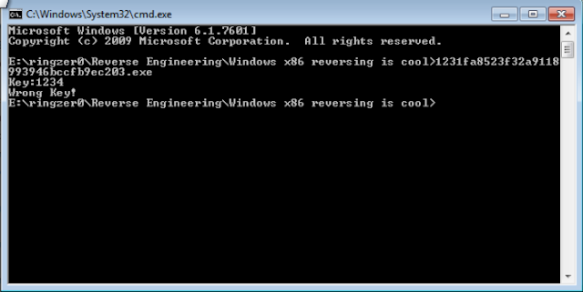
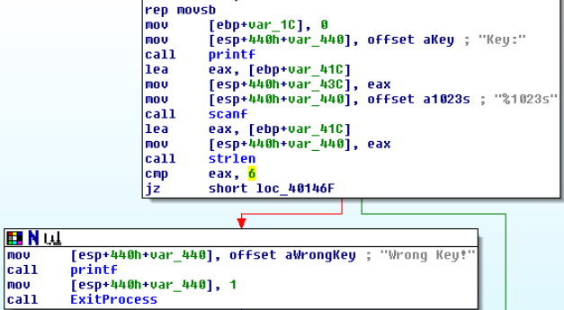
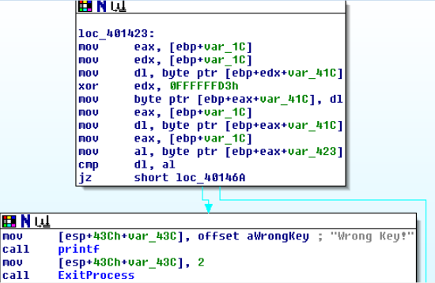
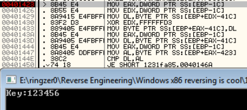
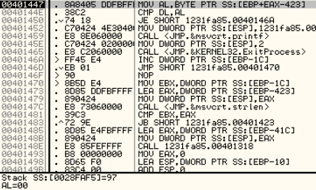
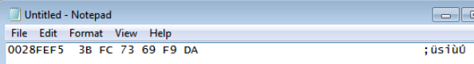
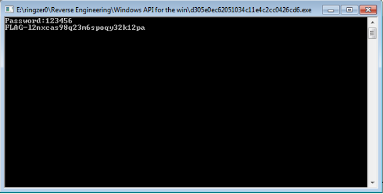

Today we'll be looking at two ringzer0 Reverse Engineering challenges called "Windows x86 reversing is cool" and "Windows API for the win". Both challenges are worth 3 and 4 points respectively.

The goal of the challenges is to find the flag hidden within.

# Windows x86 reversing is cool

When executing the application, it asks for a key. Typing in "1234" yields a "Wrong Key!" string:



## Static analysis:

Analysing the exe in IDA, we can see the key function is found at address 0x40139B. We can also see our "Wrong Key!" string in here.



As above, it looks like our key will need to be at a length of 6 otherwise "Wrong Key!" is returned.



If our key is 6 characters long, we run into another function that takes our input and XORs the input with 0xFFFFFFD3. At the end before the jump, we can see a compare against our key and the key it is expecting.

We can use Ollydbg to debug this function and find out what it is expecting.

## Dynamic analysis:

We can find all referenced strings and quickly jump to the address our "Wrong Key!" string is found at.

We set a breakpoint at the beginning of the function in the previous function. We punch in our key as "123456":



Beforehand, EBP-1C was set to 0, so both EAX and EDX registers are set to 0. The first byte of our key is placed into DL. The EDX register is XOR'd with 0xFFFFFFD3 and returns 0xFFFFFFE2. DL is then placed into the first byte of our key, essentially replacing "1" (0x31) with 0xE2.

We can see in the next screenshot that a byte from the address found at EBP+EAX-423 (0x28FAF5) is moved into the AL register, where it is then compared against our DL register.



Looping through this function, we find that it is comparing against the following values, 0x97, 0xE0, 0xEB, 0xA0, 0xB8, 0xEL, respectively.

I have created a small Python script to simulate the function to find out the exact combination of characters we need to input to hopefully crack the program:

```
import string

key = 0xFFFFFFD3

for s in string.printable:
 result = int(hex(ord(s)), 16) ^ int(hex(key), 16)
 dl = str(hex(result))[-2:]
 if dl == '97':
  print('97', s)
 if dl == 'e0':
  print('e0', s)
 if dl == 'eb':
  print('eb', s)
 if dl == 'a0':
  print('a0', s)
 if dl == 'b8':
  print('b8', s)
 if dl == 'e1':
  print('e1', s)
```

After running the script, we find the correct combination is "D38sk2", let's try that:


Hoorah!

# Windows API for the win

This challenge is much like the other one, it asks for a password and if wrong, returns "Wrong password!".

## Static analysis:

Nothing valuable is found in the strings other than the "Wrong password!" we've already come across, again, much like the previous challenge.

If we double click on the "Wrong password!" string, we are taken to what looks like the password function we're after, located at address 0x4014C9.

The following screenshot takes our password and runs through a bunch of functions that don't appear to do much. After each function call, the EAX register is reset back to the return value of GlobalAlloc. At the end of the function, a call to strlen is made, comparing our password to a length of 6 characters.

Amongst the function calls is a call to IsDebuggerPresent, but it does not matter as the return value is not used for anything. This is most likely a ploy to distract the reverser.


If our password is 6 characters long, we need to run through a second function that needs a little attention to determine what it is doing.


Starting from the top, the first byte of our password is moved into the DL register. var_1C was set to the return value of GlobalAlloc, and that is moved into EAX. A byte from EAX is moved into AL and EAX and EDX are XOR'd against each other. At this point, we don't know what EDX is set to. AL is then moved into the first byte of our password.

The same trend continues for each byte in our password. At the end of the function, we can see a call to strcmp. Let's see if we can find out what the program is expecting by stepping through the above function.

## Dynamic analysis:

We can find all referenced strings and quickly jump to the function where our "Wrong password!" string is found.

After we step through the call to scanf, we enter in our password as "123456". As mentioned above from our IDA analysis, the first byte of our password is moved into DL. Stepping through the function, we can see that 0x08 is our mystery byte that is moved into AL. EAX and EDX are XOR'd against each other, and AL is moved into the first byte of our password.

In summary:

1. Take first byte of password, put into dl
2. Move 08 into al
3. XOR eax, edx
4. Move al into first byte of password

For each consecutive byte of our password, C8 18 28 B8 E8 are moved into AL at step 2. For step 4, we can observe that 0x3B is moved into the first byte of our password.

At the end of the function before the call to strcmp, we can see the outcome of each byte of our password:


As these are not printable characters, if we were to create a script, how would be know what to be looking for? If we copy and paste them into Notepad, it is a little better:



However, it would be quite difficult to create a script as we also need to know what the EDX register is set to for step 3. Going back through the instructions, I found EDX is set by a call to strlen. We simply need to find a better way.

If you take a look at the screenshot where we can see our non-printable characters the program has calculated, in the instructions, we can see the address where the non-printable characters are located at is loaded into EAX and then moved onto the stack. The same is done for our password (after step 4). They obviously don't match.

If we continue stepping, we get to the instruction that jumps us to the "Wrong password!" area. If we alter the zero flag to trick the program into thinking our passwords matched, we come across to another instruction that takes the password and loads it into EAX at address 0x401626.

What if we changed the instruction to instead load the address of the password that the program is actually looking for? As with a couple of screenshots up at address 0x40160D, this address is located at EBP-23.


After we step over the modified instruction, let's see what happens when we execute the rest of the program:

