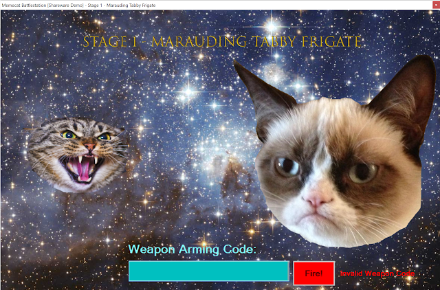
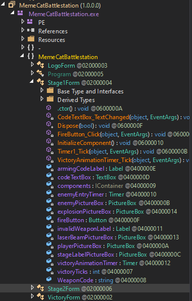
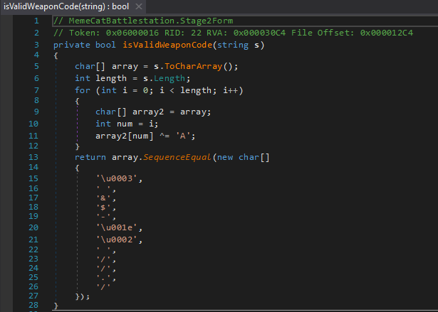
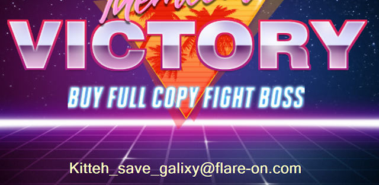

Welcome to my first Flare-on 2019 challenge write up. This challenge is called Memecat Battlestation.

The challenge comes with a readme that reads:

>Welcome to the Sixth Flare-On Challenge! 
This is a simple game. Reverse engineer it to figure out what "weapon codes" you need to enter to defeat each of the two enemies and the victory screen will reveal the flag. Enter the flag here on this site to score and move on to the next level.
>* This challenge is written in .NET. If you don't already have a favorite .NET reverse engineering tool I recommend dnSpy
>* If you already solved the full version of this game at our booth at BlackHat  or the subsequent release on twitter, congratulations, enter the flag from the victory screen now to bypass this level.

# Dynamic Analysis:

When first starting up the application, you are presented with the following screen:



After typing in "test" as the weapon arming code, a small text message to the right of the TextBox pops up, indicating we've entered in the wrong code.

There's not much to it, so let's try to find the code using static analysis.

# Static Analysis:

When we load the binary in dnSpy, we see a lot of juicy functions and form controls:



We turn our attention to the FireButton_Click function. Immediately, we find the required code to fire the weapon:


We enter the "RAINBOW" code into the application and a short animation plays, before advancing onto stage 2.

We saw the Stage2Form class earlier. Again, we turn to a function called "FireButton_Click", which checks if the code we entered matches the return value from a function called "isValidWeaponCode". Let's take a look at that function:



We can see it takes our entered code and converts it to a CharArray. It creates a for loop for the duration of our code length. Within the loop it copies our char array into another char array. It takes an index of our loop counter and uses that to access the array and XOR's it with 'A'.

Our final char array should equal the return value.

A quick Python script and we should be able to decode this function:

```
array = [0x3, ' ', '&', '$', '-', 0x1E, 0x2, ' ', '/', '/', '.', '/']
array2 = []

for char in array:
 if type(char) is str:
  result = int(hex(ord(char)), 16) ^ int(hex(ord('A')), 16)
 else:
  result = int(hex(char), 16) ^ int(hex(ord('A')), 16)
 array2.append(hex(result))
 
print(array2)
```

Entering in the result to a hex to ASCII converter and we get our final answer:


We enter our code into the Stage2Form TextBox and retrieve our flag:

