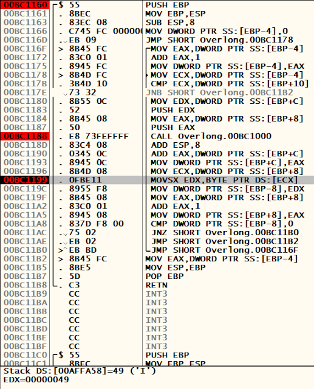
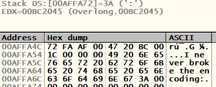
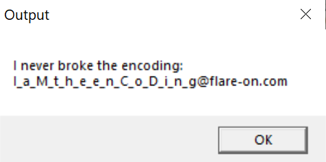

Welcome to the second Flare-on 2019 write up. For this one, we'll be looking at an application called "Overlong", which is also the name of the challenge.

The readme that comes with the challenge reads:

>The secret of this next challenge is cleverly hidden. However, with the right approach, finding the solution will not take an <b>overlong</b> amount of time.

# Dynamic Analysis:

There isn't much to the application. When executing a MessageBox shows the following:

We load the executable into Ollydbg and we start debugging. it is relatively easy to find the decoding function. Within a few steps, we come to a call to the sub routine at address 0x401160. Stepping over the call and over the next instruction shows us that the string "I never broke the encoding:" is placed into the ESP register.

We can now deduce that the function called beforehand is the function we need to be looking at.

Stepping through this function slowly, we come across another call to 0x401000. This function seems like the real decoding function. A few instructions after the call to 0x401000, I noticed the address of the ASCII character "I" is being moved into EDX:

After the execution of this instruction, we right click on the ECX register and follow the address in the memory dump. As we set a breakpoint at this instruction and run through the application, we begin to see our string being decoded in the dump:

After decoding the ":" character, the loop exits and spawns our MessageBox with the decoded text.

Initially I thought because of the ":" character, there must be more to decode. I restart the application and play through the loop again until I find the instruction that exits us out of the loop.

We come here:

We can see EAX is served as a counter. The length of the MessageBox text is 0x1c long. Coincidentally, the CMP instruction is looking for this value. If the value is not below 0x1c, it continues the loop. However, our EAX counter is 0x1c long, so the loop exits.

What happens if we NOP this instruction?

Bingo! We have retrieved the flag by patching the instruction that exits us out of the loop, which enables us to decode the rest of the text.