Today we'll be looking at a few crackmes called NoREpls made by DTM. The challenges can be found here: https://0x00sec.org/t/challenge-collection-reverse-engineering-and-crackme/3027

# Part 0:

When executing the program, we are greeted with a simple window with one button. The button does not do anything interesting. The program has two options in the menu bar, file and about. We can use the about menu to either register the program or show a MessageBox with a description of the program. The file menu has only one option, exit.

Pretty simple, let's try and crack the program.

## Static analysis:

Using strings on the program does not yield anything out of the ordinary except for the strings we saw in each window.

We load the binary into IDA Pro and check out the imports. We are only interested in one import, that being GetDlgItemTextW. This is the function used to get the user input from the registration window. Checking the cross-references for this function, there is only one, which leads us to address 0x401000.

Right away, we can see what looks to be the serial right in front of us. Let's try it.

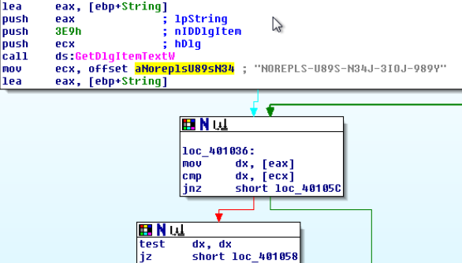

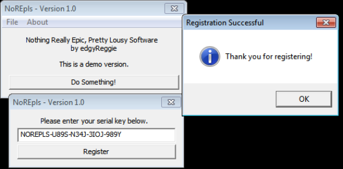

# Part 1:

Part 1 is much like the same as before, however this time a "(demo version)" is displayed in the title. We can enter some text into the text box area, but we cannot save as we need to register first.

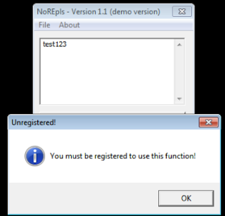

## Static analysis:

Strings does not yield any intersting strings. As such, we are interested in whatever handles our input, leading us to GetDlgItemTextA. This time, there are two cross-references, one for saving our text to a file, and the other for handling our registration.

When navigating to the function where our GetDlgItemTextA function is, we are lead to subroutine 0x4013B0.

After some instructions which look like it's looping through our registration code (returned from GetDlgItemTextA) to verify we have entered in something at all, we enter another subroutine at 0x401330 which contains two calls to CryptBinaryToStringA. At the end of this subroutine, it looks like it will either return 1 or 0. We will rename this function "crypt_func". Going back to subroutine 0x4013B0, if our return value from crypt_func is 1, we enter another subroutine at 0x402E30. One of the parameters to this function is very interesting:

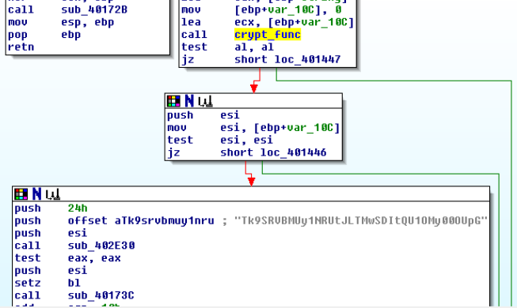

Sub_402E30 looks even more interesting and will need to be further analyzed using dynamic analysis.

Before we do that, let's find out what CryptBinaryToStringA does, as crypt_func takes our registration code and manipulates it somehow.

Using MSDN, we can see that the function converts an array of bytes into a formatted string.

We can see two calls to CryptBinaryToStringA. After the first call, a rabbit hole is introduced so it will be best to analyze these calls using dynamic analysis.

The second call is more interesting because the parameter for the buffer to receive the converted string, pszString, is defined, whereas with the first call, it was set to NULL. With this information, we cannot expect to rely on the first call to CryptBinaryToStringA as it does not immediately return the converted string.

For the second call, it takes five parameters. pcchString is set to the return value of the previous function called after our first call to CryptBinaryToStringA at address 0x401782, pszString is set to an address located in ESI, dwFlags is set to 1, which means CRYPT_STRING_BASE64, cbBinary is set to the size of our registration code, and pbBinary is a pointer to the array of bytes to be converted into a string, which is our registration code.

Judging from this, crypt_func converts our registration code into base64. At this stage, we can probably guess that our base64-encoded string is compared to the one in the above picture in the function located at 0x402E30. Let's verify this.

## Dynamic analysis:

In Olly, afetr we enter the function at 0x402E30, we can see the following on our stack:

"VEVTVA==" is the result of our registration code, which was set to "TEST". Stepping through the function shows us that each byte is being compared with the suspected base64-encoded string. Therefore, we should easily be able to decode the string to find the registration code, which returns "NOREPLS-MEKI-30H2-AMN3-49JF".

# Part 2:

As with each challenge, it builds on top of each other. This time when executing the program, a small dialog appears and we have to wait 5 seconds before we can "Continue unregistered".

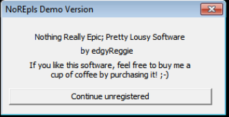

The main window is the exact same as the previous challenge.

## Static analysis:

Examing the strings, I can see a "SERIAL=" string. When we double click on this string, we see some other interesting strings that we did not see in the strings window:

The "License.lic" looks interesting, let's double click this one. We can see a call to CreateFileW which creates a file called "License.lic", and a call to WriteFile, which writes the "SERIAL=" string to the file. If we scroll up a bit, we can see a call to GetDlgItemTextA. Below that, we can see a peculiar string that might look like the encoded serial the program is expecting.

Further analysis will need to be carried out to see how we can match the program's expected registration code.

## Dynamic analysis:

With a registration code of "TEST", we come to this position (I have breakpointed all interesting addresses):

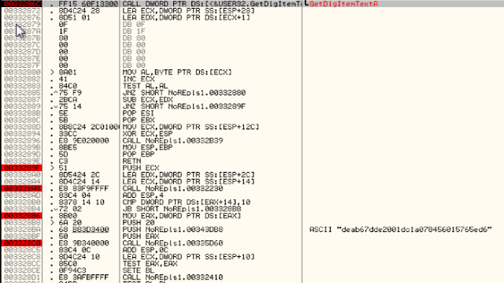

Before the intresting ASCII string is pushed onto the stack, we can also see EAX is being pushed, too. If we enter the call that sets EAX and step through the instructions, we can see it is building our string based on our registration code.

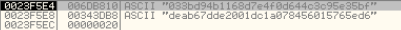

Through heavy analysis, I'm sure we could find out how the string is generated, however, this is time consuming and I'm sure there's any easier way to crack the program.

Stepping through, we can see the license file is only created if the serials above match. If not, we run into the program telling us that the registration key failed.

We can patch the program to jump to the "Thank you for registering" message to see if it fully registers the program:

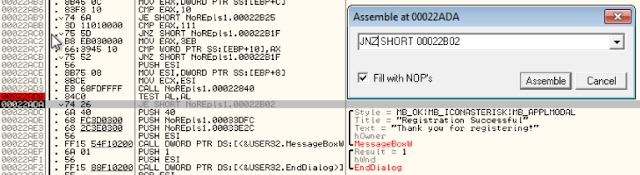

By patching the instruction, the "(demo version)" was removed from the title and we can now save our text file, however, after saving our changes and starting the patched program, the changes did not persist. We will need to create a valid license file in order for the program to think we have registered.

Since we don't know the correct registration code to create the license file, we will make the program think we have entered in the right code. If we NOP the following instruction:

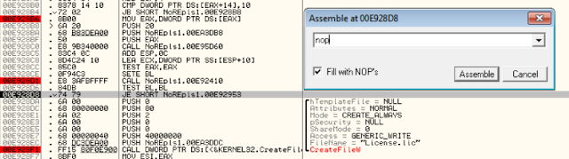

It creates a License.lic file with the contents set to "SERIAL=TEST". Now that we have our license file, it's time to get truly register our program.

We can assume that if the program finds the license file, the startup message won't appear, so let's first start with that. 

The following screenshot shows that if our serial in the license file is encoded and matches the ASCII string it is expecting, then a value of 1 will be moved into AL. However, because our serial does not match, it is set to 0. We can simply NOP this instruction:

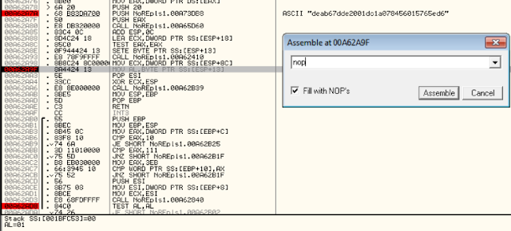

After saving our changes and starting up the cracked program, no startup message ensues, the register button is greyed out, we can save our text file and the "(demo version)" string is removed from the title. We have successfully tricked the program into thinking we have provided a valid license file!

# Part 3:

Part 3 is much like the same as the previous challenge, however, this time when registering, both a username and serial need to be provided. If the license.lic is left over from the previous challenge, the program won't start. We also get a "Licensed to nobody" in the about section.

## Static analysis:

Examing the strings, I can see a few interesting strings:

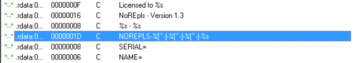

NOREPLS-XXX looks to be a serial format. SERIAL= and NAME= looks to be our license file contents.

If we double click on NOREPLS-XXX and scroll down, we can see some unicode strings such as License.lic, registration failed and invalid serial number.

Checking the cross-references for License.lic, we can see it is the same as last challenge; if the username and serial are correct, a license.lic file is created.

## Dynamic analysis:

Same as last challenge, we can patch the jump so that it jumps over the 5 second wait dialog and in turn fake-registering our program!