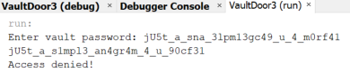
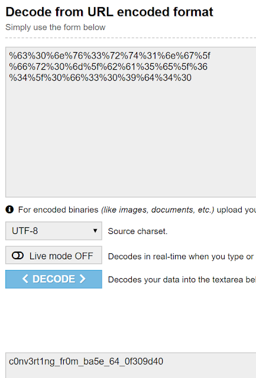

Today we'll be looking at a series of challenges created during the picoCTF event. I was unfortunately not able to complete these during the event as the event had ended before I got a chance to see what it's all about.

We will be solving the Vault Door series of challenges, with each of increasing difficulty. They are all .java files and the goal is to open up the source code and retrieve the flag.

# VaultDoorTraining

This one is super simple. The checkPassword method contains the password in plain-text. The flag is `w4rm1ng_Up_w1tH_jAv4_7e183572fa2`

# VaultDoor1

The checkPassword method is expecting 32 characters, and each character at a certain index must equal whatever it is expecting:

```
public boolean checkPassword(String password) {
    return password.length() == 32 &&
           password.charAt(0)  == 'd' &&
           password.charAt(29) == '7' &&
           password.charAt(4)  == 'r' &&
           password.charAt(2)  == '5' &&
           password.charAt(23) == 'r' &&
           password.charAt(3)  == 'c' &&
           password.charAt(17) == '4' &&
           password.charAt(1)  == '3' &&
           password.charAt(7)  == 'b' &&
           password.charAt(10) == '_' &&
           password.charAt(5)  == '4' &&
           password.charAt(9)  == '3' &&
           password.charAt(11) == 't' &&
           password.charAt(15) == 'c' &&
           password.charAt(8)  == 'l' &&
           password.charAt(12) == 'H' &&
           password.charAt(20) == 'c' &&
           password.charAt(14) == '_' &&
           password.charAt(6)  == 'm' &&
           password.charAt(24) == '5' &&
           password.charAt(18) == 'r' &&
           password.charAt(13) == '3' &&
           password.charAt(19) == '4' &&
           password.charAt(21) == 'T' &&
           password.charAt(16) == 'H' &&
           password.charAt(27) == '1' &&
           password.charAt(30) == 'f' &&
           password.charAt(25) == '_' &&
           password.charAt(22) == '3' &&
           password.charAt(28) == 'e' &&
           password.charAt(26) == '5' &&
           password.charAt(31) == 'd';}
```

The flag is "d35cr4mbl3_tH3_cH4r4cT3r5_51e7fd"
VaultDoor3 (there is no VaultDoor2):
The checkPassword method is again expecting a password length of 32 characters. The method appears to be looping through a newly created buffer and is assigning indexes of the buffer values from our password.

At the end of the checkPassword method is a flag-like looking password, which it is expecting. If we run the program and provide the password as input, it will return "Access denied".

The method stores the buffer into String s at the end, so we can modify the program to print out this value to see what it returns.

If we provide the password it is expecting as input and print out the value of "s", we get our flag!



# VaultDoor4

This challenge is asking us to convert between decimal, hex, octal and ASCII characters. Using an ASCII table such as http://www.asciitable.com/ will help us solve this one.

```
public boolean checkPassword(String password) {
    byte[] passBytes = password.getBytes();    
    byte[] myBytes = {106,85,53,116,95,52,95,98,0x55,0x6e,0x43,0x68,0x5f,0x30,0x66,0x5f,0142,0131,0164,063,0163,0137,070,060,'f','8','e','1','e','0','4','7',    
    };    

    for (int i=0; i<32; i++) {
        if (passBytes[i] != myBytes[i]) {
            return false;
        }
    }

    return true;
}
```

This translates to "jU5t_4_bUnCh_0f_bYt3s_80f8e1e047"

# VaultDoor5

This challenge uses URL and base64 encoding in order to derive the password. 

```
public boolean checkPassword(String password) {
    String urlEncoded = urlEncode(password.getBytes());    
    String base64Encoded = base64Encode(urlEncoded.getBytes());    
    String expected = "JTYzJTMwJTZlJTc2JTMzJTcyJTc0JTMxJTZlJTY3JTVm" + "JTY2JTcyJTMwJTZkJTVmJTYyJTYxJTM1JTY1JTVmJTM2" + "JTM0JTVmJTMwJTY2JTMzJTMwJTM5JTY0JTM0JTMw";
    
    return base64Encoded.equals(expected);}
```

By copying these values into a base64 decoder, we get these values respectively:

%63%30%6e%76%33%72%74%31%6e%67%5f
%66%72%30%6d%5f%62%61%35%65%5f%36
%34%5f%30%66%33%30%39%64%34%30

If we copy these values into a URL decoder, we get the following:



# VaultDoor6

This challenge is expecting a password with the following values:

```
public boolean checkPassword(String password) {
    if (password.length() != 32) {
        return false;    }
    byte[] passBytes = password.getBytes();    byte[] myBytes = {
        0x3b, 0x65, 0x21, 0xa , 0x38, 0x0 , 0x36, 0x1d,        0xa , 0x3d, 0x61, 0x27, 0x11, 0x66, 0x27, 0xa ,        0x21, 0x1d, 0x61, 0x3b, 0xa , 0x2d, 0x65, 0x27,        0xa , 0x31, 0x30, 0x30, 0x30, 0x64, 0x61, 0x33,    };    for (int i=0; i<32; i++) {
        if (((passBytes[i] ^ 0x55) - myBytes[i]) != 0) {
            return false;        }
    }
    return true;}
```

As we can see, the checkPassword method is converting our password of 32 characters into bytes. It is then XOR'ing each byte with 0x55. If the value in the myBytes array minus our return value from the XOR equals 0, it returns true.

I have created a short Python script to simulate this behaviour so that we can crack the challenge:

```
import string

key = 0x55

hex_array = [0x3b, 0x65, 0x21, 0xa , 0x38, 0x0 , 0x36, 0x1d,
   0xa , 0x3d, 0x61, 0x27, 0x11, 0x66, 0x27, 0xa ,
   0x21, 0x1d, 0x61, 0x3b, 0xa , 0x2d, 0x65, 0x27,
   0xa , 0x31, 0x30, 0x30, 0x30, 0x64, 0x61, 0x33]
   
result_array = []

for i in range(32):
 for s in string.printable:
  result = int(hex(ord(s)), 16) ^ int(hex(key), 16)
  if hex(result) == hex(hex_array[i]):
   result_array.append(s)
   
   
print("".join(result_array))
```

The following script returns "n0t_mUcH_h4rD3r_tH4n_x0r_deee14f"

# VaultDoor7

Increasing in difficulty, this challenge is expecting a password length of 32 characters, as usual, but is converting it to an integer by first converting it to bytes beforehand. After converting the password to bytes, the passwordtoIntArray method rotates an index into the hexBytes array left. This happens 8 times, of which are assigned to an index in "x", an int array.

```
public int[] passwordToIntArray(String hex) {
    int[] x = new int[8];    byte[] hexBytes = hex.getBytes();    for (int i=0; i<8; i++) {
        x[i] = hexBytes[i*4]   << 24             | hexBytes[i*4+1] << 16             | hexBytes[i*4+2] << 8             | hexBytes[i*4+3];    }
    return x;}

public boolean checkPassword(String password) {
    if (password.length() != 32) {
        return false;    }
    int[] x = passwordToIntArray(password);    return x[0] == 1096770097        && x[1] == 1952395366        && x[2] == 1600270708        && x[3] == 1601398833        && x[4] == 1716808014        && x[5] == 1734304870        && x[6] == 895891557        && x[7] == 1681142832;}
```

In order to get our password, we need to reverse this logic. For the first index into "x", it is expecting the integer 1096770097.

The passwordToIntArray method converts bytes into integers, so we need to do the reverse. 1096770097 converts to 01000001 01011111 01100010 00110001.

If we convert the bytes into hex, we get 41, 5F, 62, 31 respectively. Again, respectively, these hex values convert to ASCII characters: A_b1.

For the full conversion list, I have manually worked these out on notepad:

1096770097 = \
01000001 01011111 01100010 00110001 \
41 5F 62 31 \
A _ b 1

1952395366 = \
01110100 01011111 00110000 01100110 \
74 5F 30 66 \
t _ 0 f

1600270708 = \
01011111 01100010 00110001 01110100 \
5F 62 31 74 \
_ b 1 t

1601398833 = \
01011111 01110011 01101000 00110001 \
5F 73 68 31 \
_ s h 1

1716808014 = \
01100110 01010100 01101001 01001110 \
66 54 69 4E \
f T i N

1734304870 = \
01100111 01011111 01100100 01100110 \
67 5F 64 66 \
g _ d f

895891557 = \
00110101 01100110 00111000 01100101 \
35 66 38 65 \
5 f 8 e

1681142832 = \
01100100 00110100 00110100 00110000 \
64 34 34 30 \
d 4 4 0

This means our flag is "A_b1t_0f_b1t_sh1fTiNg_df5f8ed440"