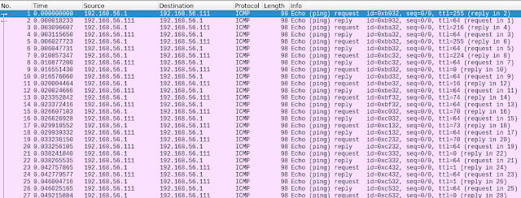
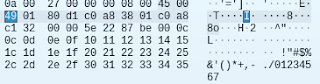
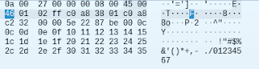
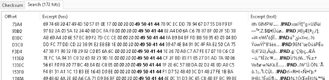
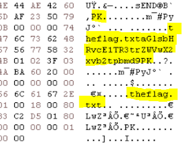
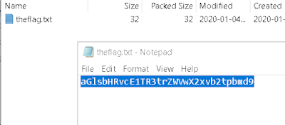
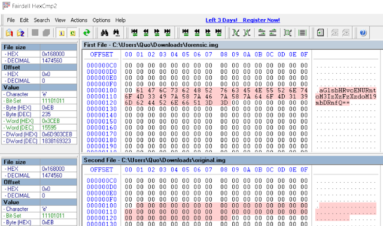

Over the past four weeks, SecurityBlue.Team have released their very first CTF event. During the first two weeks, the CTF was only available to VIP members. The last two weeks were open to the public. As it stands, there are currently over 300 participants. During the VIP tenure, there were ~50 participants, including me.

As the CTF is still open and very much active, I will not be revealing the flags. As such, I will showcase the methods I used to retrieve these flags for my favourite challenges. If you wish to have a go, visit https://sbtvip.ctfd.io/challenges, make an account and get going!

# Network Analysis - Sneaky Transmission - 50 pts

> Is this a DoS attack? Or could this be ... a photo!?

When downloading the attached file for this challenge, we receive a sneaky_transmission.pcapng file. Viewing this file in Wireshark yields a packet capture full of ICMP packets.

As with all packet captures, we need to know what we're dealing with and how the protocol works in order to ascertain what the high level goal of the capture is.



Generally when viewing ICMP packet captures, we need to bring our attention to a few things. First, we take note of the length of packet. They are all a length of 98 bytes. If it were anomalous, we could deem it as suspicious. Speaking of anomalous, we turn our attention to the TTL (time to live). Notice anything? All request packets have a different TTL set. This could be an indication of ICMP data exfiltration, or ICMP tunnelling.

We can begin to inspect the payload data of the request packets to see if we can make out any data being sent over the network. We can use the filter "icmp.type == 8" to only display request packets. When scrolling through each packet, we see part of the data section contains the same bytes:


As we scroll through each packet, we note the changing bytes. For the first few packets, it doesn't look like much, until we get further down to frame no. 13. With a sharp eye, you might notice the following sequence of bytes:






What do the highlighted bytes spell? JFIF! (without the exclamation mark). JFIF is the magic number for a JPEG image. The description of the challenge also confirms for us that the data being sent in the payload is a JPEG image. Next we need to extract the data.

At the time of my attempt at this challenge, I missed one important detail about the packets. The above highlighted bytes correpsond to the TTL value. Meaning the JPEG image was hidden in the TTL field, which would've made for easier extraction.

Admittedly, I did not extract the data using Wireshark nor using normal means via scripting. I used the Scapy Python module to exract the data but since I could not find a sure-fire method of extracting the exact bytes I wanted, so instead I implemented a method called Monkey Patching.

As mentioned, we will be using the Scapy Python module, a very popular packet manipulation tool.

Our goal is to extract each byte at a specific offset of the payload data.

As you can see with the above, the only data from the payload we can print is the fixed data. It does not change.

Using the hexdump method Scapy provides, we can print out a hexdump of the payload data, exactly how it is displayed in Wireshark. The problem with this output is that it's type is NoneType. It doesn't output as a string. If this were the case, I could extract the specific bytes I needed using string slicing.

The only fix I managed for this was to edit the hexdump method provided by the Scapy library.

Located in the utls.py file, we can copy and paste the hexdump method into our own Python script:

```
from scapy.all import *
 
pkts = rdpcap("sneaky_transmission.pcapng")

def hexdump(x, dump=False):
    """Build a tcpdump like hexadecimal view

    :param x: a Packet
    :param dump: define if the result must be printed or returned in a variable
    :returns: a String only when dump=True
    """
    # EDIT: create an empty list to append our bytes to
    sneaky_bytes = []
    s = ""
    x = bytes_encode(x)
    x_len = len(x)
    i = 0
    while i < x_len:
        s += "%04x  " % i
        for j in range(16):
            if i + j < x_len:
                s += "%02X " % orb(x[i + j])
                # EDIT: we only want to extract specific bytes
                if i == 0 and j == 8:
                    # EDIT: append those bytes to our list
                    sneaky_bytes.append(orb(x[i + j]))
            else:
                s += "   "
        s += " %s\n" % sane_color(x[i:i + 16])
        i += 16
    # remove trailing \n
    s = s[:-1] if s.endswith("\n") else s
    if dump:
        return s
    else:
        # EDIT: create a new jpeg file and append our bytes to the file
        with open('sneaky.jpg', 'ab') as fout:
            fout.write(bytearray(sneaky_bytes))
        #print(s)
```

I have created comments with "EDIT: " prepended to them to indicate which lines I have added.

If we execute this script, the specific bytes are extracted and appended to a JPEG file. If we open the JPG file after execution, our flag is revealed!

# Password Cracking - Jumbled - 50 pts

> 
    I've found a hash of the password for the domain controller.
    01F3273F68195C29A1A2365BE7AD2B1AAD469A73
    I've also found this note:
    Company Password Policy:
    1 hex digit prepended
    1 hex digit appended
    First letter capitalised
    An '@' appended to the end
    Leetspeak (a => 4, b => 6, e => 3, g => 9, i => 1, o => 0, s => 5, t => 7, z => 2) [Capital letters not included]
    Example: rockme => fR0ckm37@

    Can you crack the hash using rockyou.txt?

    The flag is HilltopCTF{password}

This challenge was meant to be cracked using John The Ripper, however, I did not think to use it and instead began writing a Python script to brute force the hash.

In order to compute hashes and compare it to the one provided in the description of the challenge, we first need to determine what type of hash it is. Using Hash Analyzer, we can see it is a SHA1 hash.

Overall, we need to derive a password in the format of <hex_digit> <first_letter_capitalized>  <lowercase_leetspeak> <hex_digit> <@_sign>.

We do this by first looping through the rockyou.txt file (HUGE file by the way, 14 million lines long), capitilize the first letter, substitute applicable letters for their leet counterparts (remember Python strings are immutable), prepend and append a hex digit to the output, and append an @ sign to the end of the final string.

Lastly, compute the hash of the final string and compare it with the one provided in the description of the challenge.

I ran into an error when looping through the rockyou.txt file with regards to the encoding. The encoding of the file is supposedly UTF-8, but there are characters littered within that do not translate very well. I have used the codecs Python library to loop through each line and if any encoding errors are encountered, ignore them.

Running the following Python script takes ~1 hour to derive the correct hash and therefore provide us with thr flag to complete the challenge:

```
import string
import hashlib
import codecs

leetspeak = {
    'a': '4',
    'b': '6',
    'e': '3',
    'g': '9',
    'i': '1',
    'o': '0',
    's': '5',
    't': '7',
    'z': '2'
}

counter=0

with codecs.open('rockyou.txt', 'r', encoding='utf8', errors='ignore') as fin:
    for word in fin:
        print(counter, word)
        sample_text = word

        upper_text = sample_text[0].upper()
        upper_text += sample_text[1:]

        for s in upper_text:
            if s.lower():
                for k, v in leetspeak.items():
                    if k==s:
                        upper_text = upper_text.replace(s, v)
                        
        new_text = "".join(upper_text.split())
        for first_hex_digit in string.hexdigits:
            for last_hex_digit in string.hexdigits:
                hex_text = f"{first_hex_digit}{new_text}{last_hex_digit}@"
                
                hash = '01F3273F68195C29A1A2365BE7AD2B1AAD469A73'		
                sha = hashlib.sha1(hex_text.encode('utf-8')).hexdigest()
                if sha.upper() ==  hash.upper():
                    print(f"FOUND MATCH: {hex_text}")
                    with open('jumbled_flag.txt', 'w') as fout:
                        fout.write(f"{hex_text}")
                    d = input()
                
        counter+=1
```

# Forensics - Repair Shop - 50 pts

We got this file but the transmission might have corrupted it. Maybe our main suspect has tampered with the file. Help us to recover the file and the information we need!

The file provided to us for this challenge is named 'unfixed' and does not have an extension. If we examine the file in a hex editor, we can see the first few bytes are the following:

‰PIG

���
IHDR��á��µ���¦ä��_zTXtRaw profile type exif��

PIG is not a valid magic number, but the IHDR chunk indicates this is a PNG file. We can find the PNG file structure documentation here: http://www.libpng.org/pub/png/spec/1.2/PNG-Chunks.html

PIG should be corrected to PNG. If we run pngcheck in our Kali Linux VM, we get the following:

pngcheck unfixed 
unfixed  illegal (unless recently approved) unknown, public chunk IPAD
ERROR: unfixed

Using our hex editor, we can search for all instances of IPAD:



There are 172 instances of invalid IPAD chunk types! If we refer back to the PNG specification, we take note of the critical chunks a PNG must contain (or not). "A valid PNG image must contain an IHDR chunk, one or more IDAT chunks, and an IEND chunk."

Our unfixed file has an IHDR chunk, and... What's this? An IEND chunk should note the end of a PNG file, howevever, I noticed something at the end of the file in the hex editor:



Is this the flag we're looking for? I have highlighted the interesting parts. We can see a PK text here. Consulting the magic numbers list, PK denotes the header of a ZIP file. Let's try and open the unfixed file as an archive!



You might be asking why I'm revealing the flag to you. Well, if we copy and paste this into a base 64 decoder, it yields hilltopMSG{keep_looking}, which definitely is not our flag. Oh well, let's keep looking.

Going back to our hex editor, we can see the text sEND just before the PK header. We can correct this to IEND.

We cannot have an image with a ZIP file appended to it, so we can remove all bytes after the IEND.

Okay, that's PNG, IHDR, IEND, so the only thing that is left is the IDAT chunks. As stated in the specification, there can be multiple of them. So if we search and replace all occurrences of IPAD to IDAT, we can open the fixed image and reveal our flag.

# Forensics - Floppy Offset - 25 pts

When we seized an old laptop and floppy disks, we identified an odd one. The forensic image didn't match with the original. We can assume that there was some tampering. Also, the label on the floppy disk makes no sense to us. Can you recover the hidden information in the floppy disk?

There are three files included in this challenge, floppydisc.png, forensic.img, and original.img.

We'll focus on the png file first, as I wanted to find out what the picture meant.


Googling for "rscds book 52 fnc" yields a YouTube video which I found funny. I don't think it has much to do with the overall flag.

If we compute a hash for both the forensic and original images, we see a difference. If we use a hex compare utility to see which bytes are different, we see the following:



If we copy and paste this into a base 64 decoder, our flag is revealed.

# General Knowledge - Twin - 25 pts

Find the only pair of identical lines.

Sounds easy? Well, you've only got 88000 lines across 4400 files to compare.

The flag format is HilltopCTF{}.

Well then, I'm sure a simple Python script should be able to loop through each line within all files and check if we have already looped through a specific line:

```
import os
import base64

seen = set()
for root, dirs, files in os.walk("Twin", topdown=False):
	for name in files:
		with open(f"Twin\\{name}", 'r') as fin:
			for line in fin:
				line_lower = line.rstrip().lower()
				if line_lower in seen:
					print(line)
					print(base64.b64decode(line))
				else:
					seen.add(line_lower)
```

Once it finds a duplicate line, it decodes it from base 64 to reveal something that is not a flag. Parts of the text have patterns, so maybe we need to decode it further. If we input the text into a ROT-13 decoder, our flag is revealed.