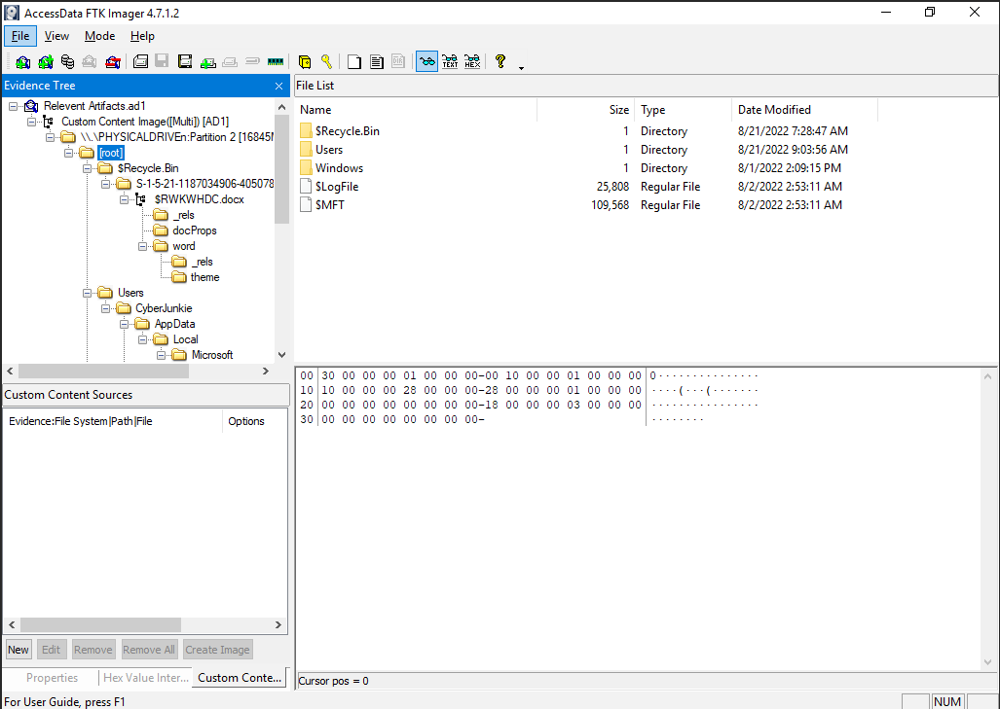
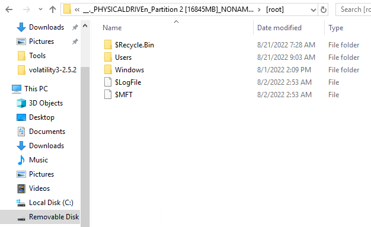
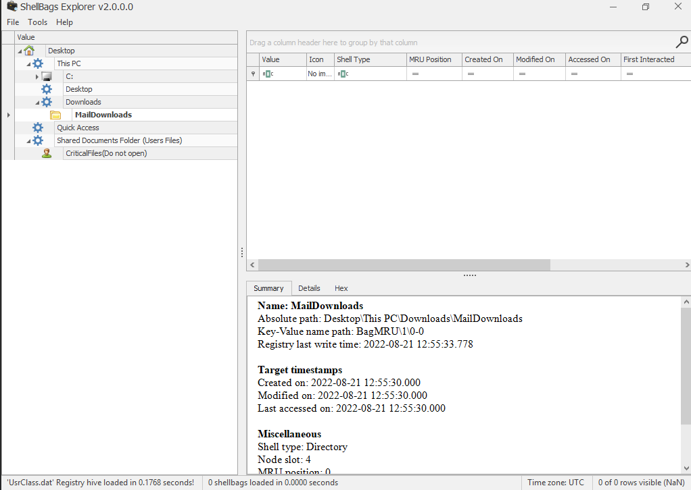
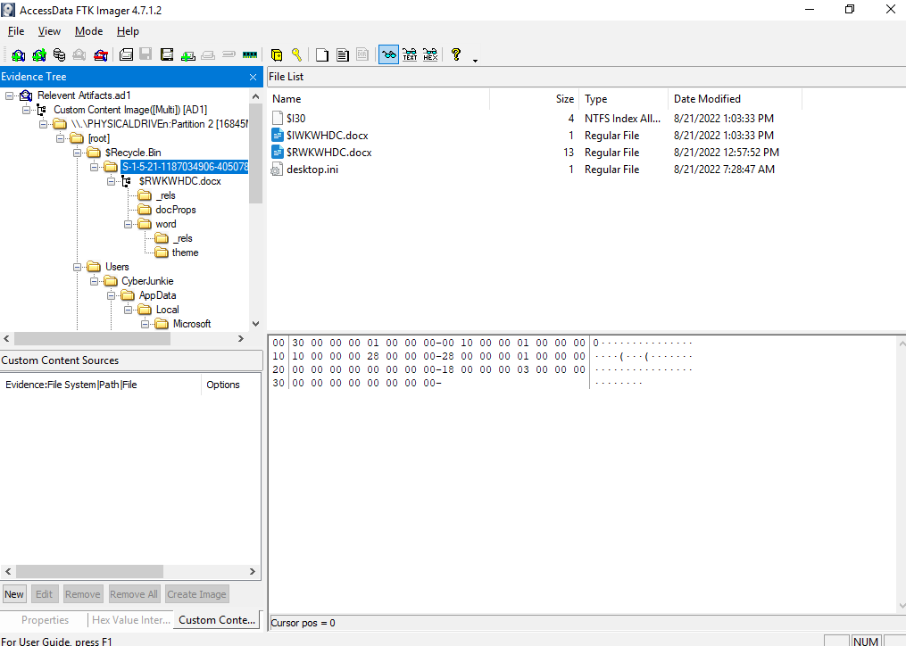
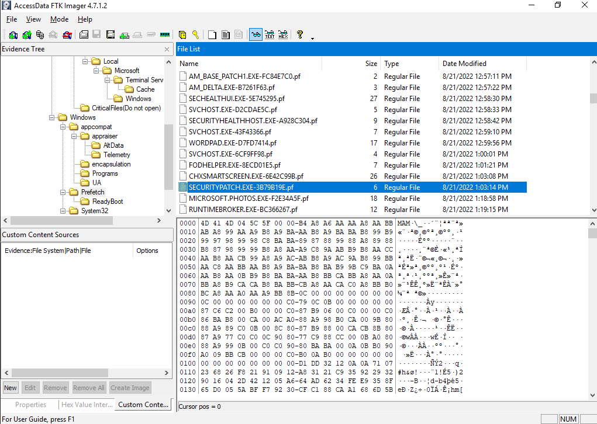
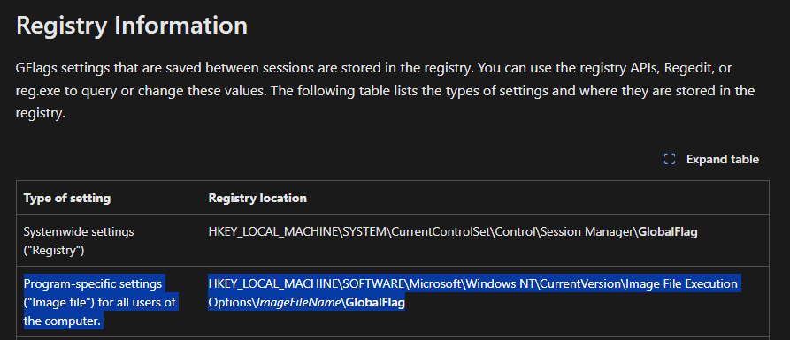
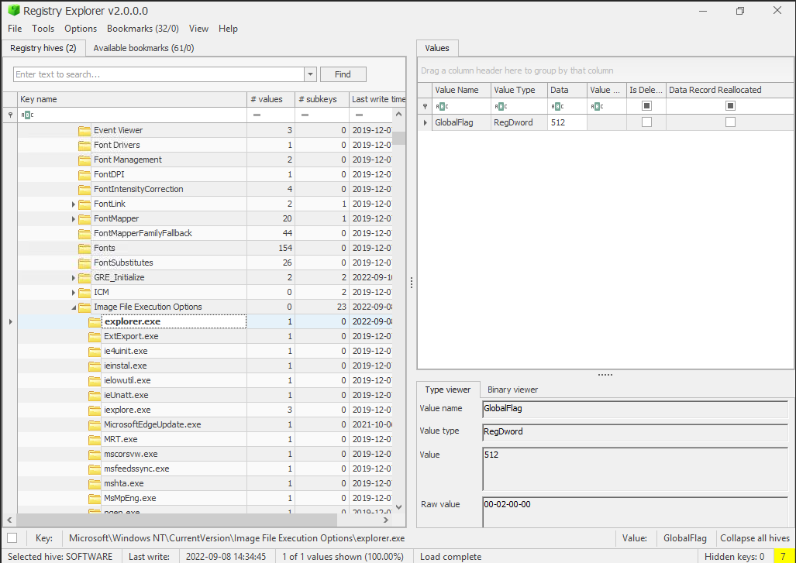
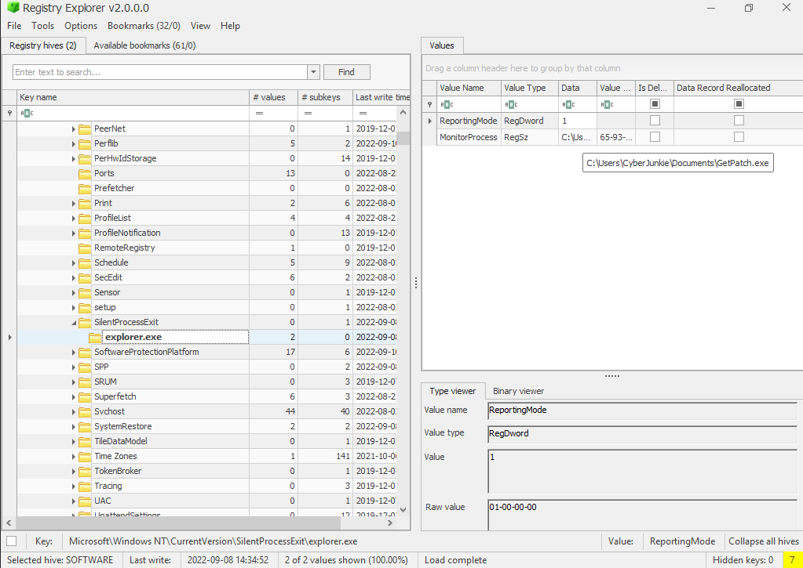

This challenge involves analyzing a scenario of lateral movement and persistence following initial access.

We use various DFIR tools to examine the investigation files.

The challenge is marked as HARD by LetsDefend: https://app.letsdefend.io/challenge/windows-forensics

# Windows Forensics

1. Initial Access was made through a Malicious Document delivered through email. What was the full path where the document was downloaded?

Trouble exporting files as is.

Needed to mount the drive to a logical disk to view the [root] directory.

No downloads folder. Need to look elsewhere.

The full path is determined by mounting the drive and analyzing the file system. The absence of a Downloads folder suggests the document was stored in an alternative location.

2. ShellbagsExplorer UsrClass.dat

UsrClass.dat is a registry hive file located in `C:\Users\<Username>\NTUSER.DAT\Classes` that stores user-specific shell settings, including folder views and recently accessed directories. ShellbagsExplorer is used to parse this file to reconstruct user activity, such as file access locations [see Microsoft documentation on registry hives](https://docs.microsoft.com/en-us/windows/win32/sysinfo/registry-hives).

3. What's the document name? (The document which was delivered via phishing)

We know it’s in the Downloads folder. There is no downloads folder in the retrieved files.

I saw this before:

We can use Eric Zimmerman's RBCmd

`RBCmd.exe -f $IWKWHDC.docx`

It prints the original file name, and the file was deleted on `2022-08-21 13:03:33`.

The document name is extracted using RBCmd, which recovers the original filename from the Recycle Bin metadata. The deletion timestamp indicates when it was removed.

4. What's the stager name which connected to the attacker C2 server (Full path\name)

Given the deletion time of the document file, we can navigate to the Prefetch directory within FTK Imager to understand what programs were executing around that time. Sort by date modified.

We can use PEcmd.exe for more info on this exe

After running `PEcmd.exe -f SECURITYPATCH.EXE-3B79B19E.pf`

We can see the original directory this executable was found in.

The stager executable is identified through Prefetch data, with PEcmd providing the original directory and filename from the prefetch file.

5. The attacker manipulated MACB Timestamps of the stager executable to confuse Analysts. Analyze the timestamps of the stager and verify the original timestamp and tampered one. (ORIGINAL TIMESTAMP : TAMPERED TIMESTAMP)

Found this on MACB Timestamps: https://cscclabs.medium.com/mac-b-timestamps-86b40d7e7144

> **Difference between $STANDARD_INFO & $FILE_NAME:**
> 
> $STANDARD_INFO can be modified by user level processes.
> $FILE_NAME can only be modified by the system kernel. There are no known anti-forensics tools that can modify this.

We can explore the MFT file for more information on this file.

`python analyzeMFT.py -f $MFT -o output.csv`

After searching for the exe in Notepad++, we can see the original creation time.

My answer was still wrong.

Looking back on the previously linked article, there is a STD (Standard) and FN (File Name) variable I need to pay attention to.

Reviewing the MFT output, I was looking at the wrong field (Standard) instead of File Name.

The tampered time is the STD, which again, can be altered by user level processes. The original creation time is found in the `FN Info Creation Date` field.

Timestamps are analyzed using the MFT file, comparing the $STANDARD_INFO (tampered) and $FILE_NAME (original) attributes to identify discrepancies.

6. The attacker set up persistence by manipulating registry keys. All we know is that GlobalFlags image file technique was used to set up persistence. When exiting a certain process, the attacker persistence executable is executed. What's the name of that process?

https://learn.microsoft.com/en-us/windows-hardware/drivers/debugger/gflags-details

Setting GlobalFlags involves configuring the Windows Global Flag registry settings, typically under `HKEY_LOCAL_MACHINE\SYSTEM\CurrentControlSet\Control\Session Manager`, to enable debugging or monitoring features. In this context, it is used with the Silent Process Exit (SPE) mechanism to execute a persistence executable when a monitored process exits [see Microsoft documentation on GFlags](https://docs.microsoft.com/en-us/windows-hardware/drivers/debugger/gflags).

7. Whats the full path alongside name of the executable which is setup for persistence? (FULLPATH\Filename)

https://learn.microsoft.com/en-us/windows-hardware/drivers/debugger/registry-entries-for-silent-process-exit

> Beginning with Windows 7, you can use the **Silent Process Exit** tab in GFlags to enter the name of a process that you want to monitor for silent exit.
> 
> Global settings are stored in the registry under the following key.
> **HKEY_LOCAL_MACHINE\SOFTWARE\Microsoft\Windows NT\CurrentVersion\SilentProcessExit**

The full path and name of the persistence executable are determined from the registry key `HKEY_LOCAL_MACHINE\SOFTWARE\Microsoft\Windows NT\CurrentVersion\SilentProcessExit`.

8. The attacker logged in via RDP and then performed lateral movement. Attacker accessed an Internal network-connected device via RDP. What command was run on cmd after successful RDP into other Windows machine?

There are RDP Event logs

We can see RDP into 192.168.18.8 at September 8th 2022.

But how do we see what command was run on the other machine?

Found this: https://medium.com/@ronald.craft/blind-forensics-with-the-rdp-bitmap-cache-16e0c202f91c

The tool we need to use is `bmc-tools.py`

The cache file can be found in `C:\Users\<USER>\AppData\Local\Microsoft\Terminal Server Client\Cache\`

After generating an output with `python bmc-tools.py -s cache -d output -b`

We export 1000+ small BMP images.

No tools exist on the machine to piece together the puzzle, so it’s manual work. Eventually, I found a command being run on the command prompt.

The command run on the CMD prompt is reconstructed from the RDP bitmap cache using `bmc-tools.py`, requiring manual analysis of exported BMP images.

9. The attacker tried to download a tool from the user's browser in that second machine. What's the tool name? (name.ext)

I answered this question, tediously, through the previous method.

The tool name is identified through manual analysis of the RDP bitmap cache images generated by `bmc-tools.py`.

10. What command was executed which resulted in privilege escalation?

When reviewing the SYSTEM event logs, there are no 4688 events, but we can see a peculiar log which registers a service.

The command to register a service is `cmd.exe /c echo kyvckn > \\.\pipe\kyvckn`

Researching more on the format of this command and what it’s doing led me to this page: https://bherunda.medium.com/hunting-named-pipe-token-impersonation-abuse-573dcca36ae0

The command `cmd.exe /c echo kyvckn > \\.\pipe\kyvckn` facilitates privilege escalation through named pipe token impersonation. This technique involves creating a named pipe and using it to impersonate a higher-privileged token, often by exploiting a service or process with elevated rights. The attacker writes to the pipe (`kyvckn`), allowing them to steal or duplicate the token for unauthorized privilege elevation [see details on named pipe impersonation](https://docs.microsoft.com/en-us/windows/win32/ipc/named-pipes).

11. What framework was used by the attacker?

This command can be used by the Metasploit framework (Meterpreter).

The Metasploit framework, specifically the Meterpreter payload, is identified as the likely tool used, given its capability to execute such named pipe commands for privilege escalation.
