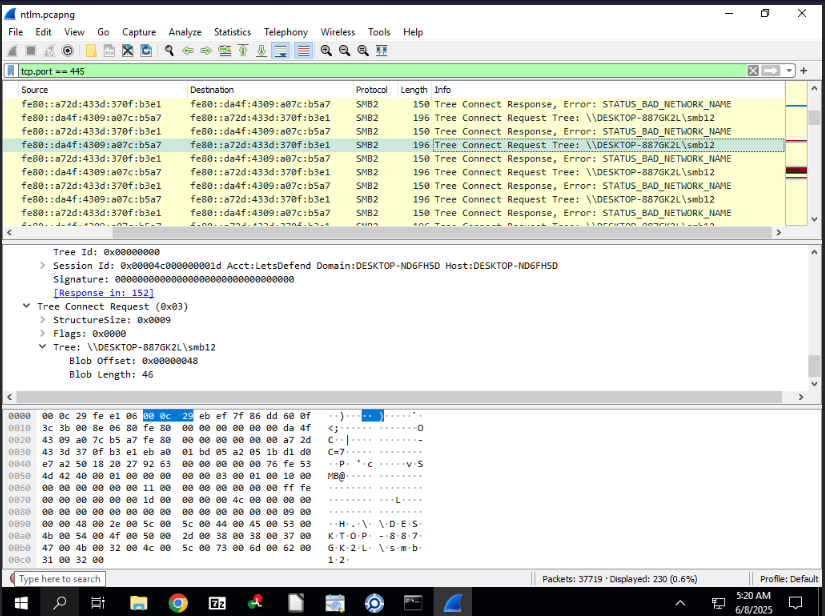
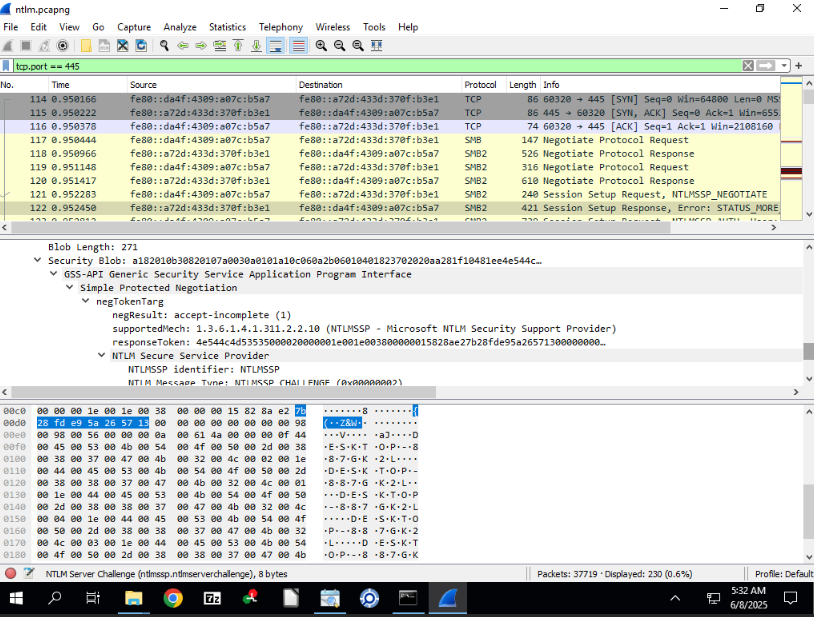
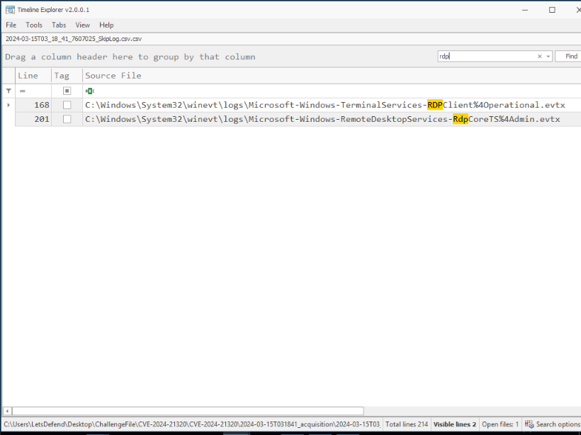
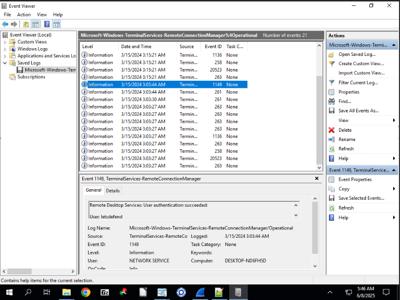
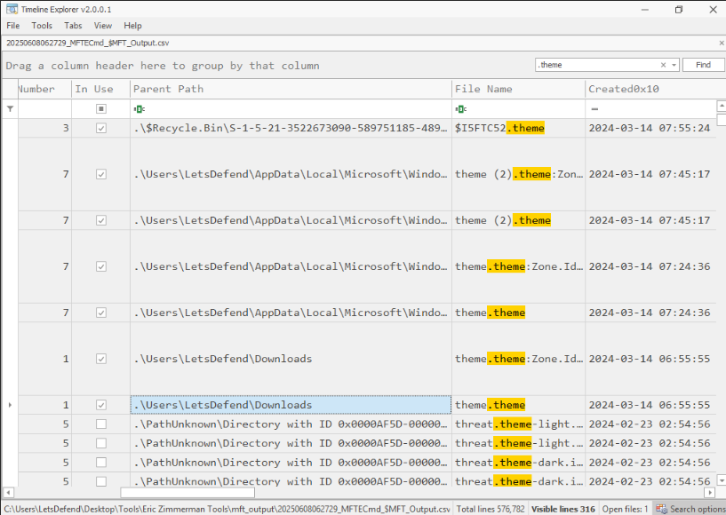

This challenge is marked as HARD by LetsDefend: https://app.letsdefend.io/challenge/windows-theme-spoofing

We use a combination of Wireshark and MFT Viewer to analyze the investigation files using DFIR methods.

# Windows Theme Spoofing

For more information on the vulnerability we'll be inspecting: https://www.rbtsec.com/blog/cve-2024-21320-windows-themes-spoofing-vulnerability-walkthrough/

This CVE-2024-21320 exploit involves a malicious Windows theme that triggers NTLM hash disclosure without user interaction. The analysis is conducted using the following steps.

**1. Can you identify the Attacker's file share path utilized to exploit the CVE?**

The attacker’s file share path is identified through Wireshark packet analysis of SMB traffic related to the theme file.

**2. Victim's NTLM hash was relayed to the attacker's server allowing them to capture the hash and either use it in NTLM relay attacks or crack the hash. What is the Full Username of the compromised account?**

Same screenshot as above

The full username of the compromised account is determined from the NTLM authentication details in the Wireshark capture.

**3. The victim's credentials were relayed to attackers 3 times. Considering only the packets related to the first relay, what is the NTLM Server challenge used in the NTLM negotiation?**

The NTLM Server Challenge for the first relay is extracted from the relevant packet in the Wireshark capture. This challenge is a random value generated by the server to secure the NTLM authentication process.

**4. What is the NTProofStr value in the NTLM negotiation?**

As above, next packet in the request

The NTProofStr value is obtained from the subsequent packet following the NTLM Server Challenge in the Wireshark capture. NTProofStr, or NT Proof String, is a hashed response generated by the client using the NTLM Server Challenge and the user’s password hash [see Microsoft documentation on NTLM](https://docs.microsoft.com/en-us/windows/win32/secauthn/microsoft-ntlm). It serves as proof of the client’s knowledge of the password, enabling the server to verify authenticity without transmitting the password in plaintext.

**5. Security team saw an RDP connection from the Attacker's internal machine to the compromised victim's machine, a day after the CVE was exploited. When did the attacker log on successfully?**

The successful RDP logon time is identified from the security event logs, specifically event 4624, recorded a day after the exploit.

**6. Tracing back to the start of the exploitation, what was the name of the file used to exploit the victim and exploit the CVE. Please detail the full path of the file.**

The file used to exploit the victim is traced using MFT Viewer, with the full path determined from the file system analysis.

**7. Attacker downloaded a Powershell script on the system, to further their objectives. What is the name of the script?**

Search for .ps1

The name of the PowerShell script is identified by filtering event logs for .ps1 files, using a 4104 event code search.

**8. Attacker Added a backdoor account for persistence mechanisms. What is the username and password of the newly created account?**

Auditing for Account Management not enabled. Security logs show no 4720 events.

The attacker gained access around 2024-03-14 06:55.

Therefore, analysis shifts to other event logs following the initial access.

Review of PowerShell event logs (4104) after the incident timeline indicates the attacker executed a command to create a new user account.
